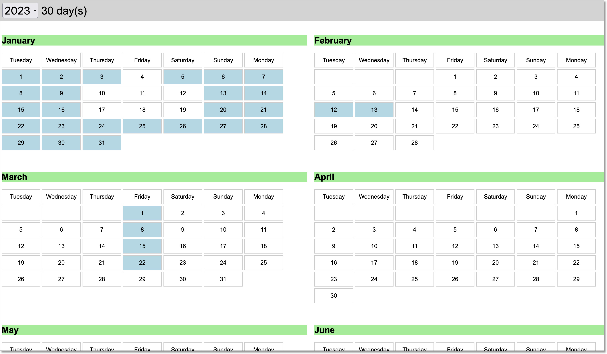

# Calendar Day Counter

A clickable calendar that shows the number of days selected in a year.

Useful for counting days in a year for example calculating 183 days in a year.

View it [here](https://htmlpreview.github.io/?https://github.com/jknight/days-in-year-counter/blob/main/index.html)

